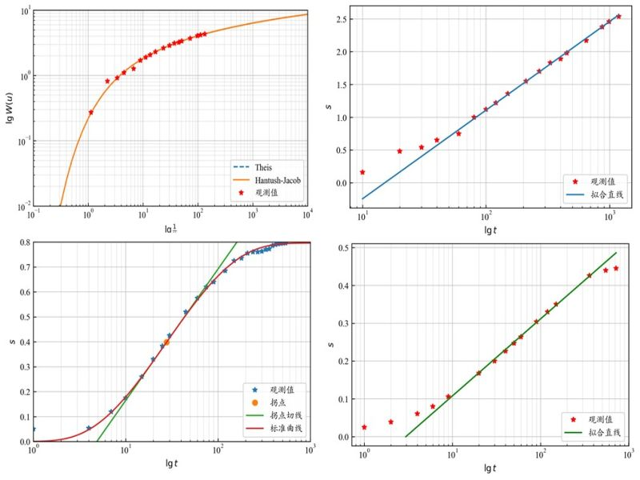

# Pumping Test
This program is applicable for parameter determination using single-well observation data from pumping tests.



本应用提供以下功能：

- **配线法**：用 Theis 或 Hantush-Jacob 公式配线，可以求出 T、S。
- **直线图解法**：用 Jacob 公式配线，可以求出 T、S。
- **拐点法**：用 Hantush-Jacob 曲线拐点性质求参，可以求出 T、S、B。
- **Jacab公式最小二乘法**：根据 Jacob 公式用最小二乘法拟合，可以求出 T、S。

运行:

```
streamlit run main_app.py
```

>
> **说明：**
>
> - 本程序适用于抽水试验的单孔观测数据求参。
> - 数据为 csv 格式, 需包含 4 列数据: 时间(min), 降深(m), 抽水量(m³/min), 观测距离(m); 
> - 可以下载预览中的数据来了解该文件格式。
> - 可以生成 docx 格式文件下载。
>   
